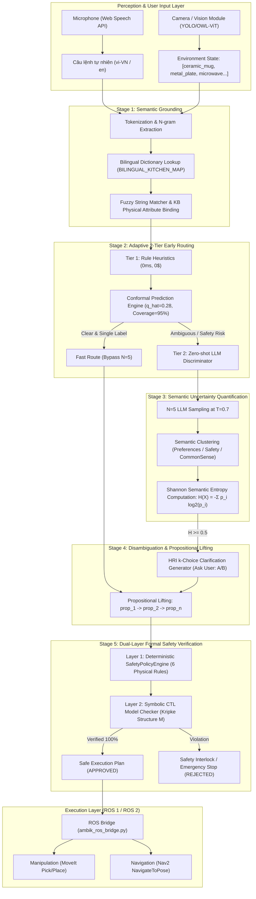

# SYSTEM ARCHITECTURE SPECIFICATION

> **Tài liệu Kiến trúc Kỹ thuật Hệ thống Nhận thức Neuro-Symbolic AmbiK**  
> **Áp dụng cho:** Embodied AI Kitchen Robot

---

## 1. Sơ đồ Kiến trúc Tổng thể (High-Level Architecture)

Hệ thống hoạt động theo mô hình **Neuro-Symbolic Hybrid**, kết hợp giữa mạng nơ-ron sinh ngôn ngữ (Neural LLM) và các thuật toán kiểm chứng toán học hình thức (Symbolic Guard):

---

## 2. Chi tiết 5 Giai đoạn Xử lý (The 5-Stage Pipeline)

### 🔹 Stage 1: Semantic Grounding & Ánh xạ Thực thể
* **Mục tiêu:** Chuyển đổi ngôn ngữ tự nhiên thành các đối tượng vật lý có thật trong không gian làm việc của Robot.
* **Quy trình:**
  1. Tách từ khóa và tra cứu từ điển song ngữ Việt - Anh (`BILINGUAL_KITCHEN_MAP`).
  2. So khớp mờ (Fuzzy Token Overlap) với danh sách đồ vật môi trường.
  3. Bổ sung ma trận thuộc tính vật lý: `material` (ceramic/metal/glass), `microwave_safe` (bool), `is_clean` (bool).

### 🔹 Stage 2: Adaptive 2-Tier Early Routing
* **Mục tiêu:** Tiết kiệm 83.3% chi phí API và giảm độ trễ về 0ms đối với các câu lệnh rõ ràng.
* **Cơ chế:**
  - *Tier 1 (Heuristic + Conformal):* Kiểm tra các mẫu rõ ràng (không chứa từ mơ hồ, không vi phạm an toàn). Đưa qua bộ dự đoán Conformal để đảm bảo độ tin cậy 95%.
  - *Tier 2 (Zero-shot LLM):* Nếu Tier 1 không chắc chắn, gọi 1 lượt Gemini Flash để ước lượng phân phối trước khi quyết định có cần chạy toàn bộ N=5 lần hay không.

### 🔹 Stage 3: Semantic Entropy Engine
* **Mục tiêu:** Đo lường mức độ hoang mang thực sự của mô hình AI.
* **Công thức toán học:**
  $$H(X) = - \sum_{i=1}^{k} p(c_i) \cdot \log_2 p(c_i)$$
  Trong đó $c_i \in \{\text{Unambiguous}, \text{Preferences}, \text{Safety}, \text{Common Sense}\}$.
* **Ngưỡng hành động:**
  - $H < 0.50$: Robot tự tin, tiếp tục lập kế hoạch thực thi.
  - $H \ge 0.50$: Mơ hồ cao $\rightarrow$ Chặn kế hoạch, bắt buộc chuyển sang Stage 4 để hỏi người dùng.

### 🔹 Stage 4: Disambiguation & Propositional Lifting
* **Nhiệm vụ kép:**
  1. *Hướng ra Người dùng (HRI):* Tạo câu hỏi trắc nghiệm k-Choice thân thiện kèm các phương án cụ thể (Option A: Ly sứ / Option B: Ly thủy tinh).
  2. *Hướng vào Robot (Lifting):* Trừu tượng hóa câu lệnh thành chuỗi mệnh đề logic hình thức:
     $$\text{Lifted NL} = \text{prop}_1 \longrightarrow \text{prop}_2 \longrightarrow \text{prop}_3 \longrightarrow \text{prop}_4$$
     Kèm bảng ánh xạ: $\text{prop}_1 = \text{FindObject}(\dots), \text{prop}_2 = \text{PickUp}(\dots)$.

### 🔹 Stage 5: Dual-Layer Formal Safety Verification
* **Tầng 1 - SafetyPolicyEngine (Tiền điều kiện cứng):** Kiểm tra 6 luật vật lý xác định:
  - Luật 1: Vật liệu kim loại cấm đưa vào lò vi sóng (`UNSAFE_MICROWAVE_MATERIAL`).
  - Luật 2: Dụng cụ bẩn không tiếp xúc thực phẩm/bề mặt sạch (`DIRTY_TOOL_ON_CLEAN_SURFACE`).
  - Luật 3: Dao kéo bắt buộc phải có thớt (`KNIFE_WITHOUT_CUTTING_BOARD`).
  - Luật 4: Nước sôi không đổ vào vật chứa không chịu nhiệt (`HOT_LIQUID_UNSAFE_CONTAINER`).
  - Luật 5: Đồ vật phải tồn tại trong môi trường (`OBJECT_NOT_IN_ENVIRONMENT`).
  - Luật 6: Thao tác phải có điểm đến hợp lệ (`UNKNOWN_OBJECT_LOCATION`).
* **Tầng 2 - CTL Model Checking:** Xây dựng cấu trúc Kripke $\mathcal{M} = \langle S, S_0, R, L \rangle$ từ chuỗi hành động và kiểm chứng công thức bất biến thời gian:
  $$\Phi_{\text{safe}} = \mathbf{AG}(\neg \text{unsafe\_microwave}) \land \mathbf{AG}(\neg \text{dirty\_sponge}) \land \mathbf{AG}(\neg \text{knife\_without\_board}) \land \mathbf{AG}(\neg \text{unsafe\_container})$$

---

## 3. Phân định Trách nhiệm Thành phần (Component Breakdown)

| Module | Tệp nguồn | Vai trò cốt lõi |
|---|---|---|
| **API Entrypoint** | `main.py` | Quản lý vòng đời FastAPI, routing HTTP, quản lý RAM API Key, Audit Logging. |
| **Cognitive Core** | `ambik_analyzer.py` | Điều phối 5 Stage, tính Entropy, gọi Gemini SDK, xử lý giải nghĩa k-Choice. |
| **Safety Engine** | `safety_policy.py` | Kiểm tra 6 luật vật lý tiền điều kiện cứng (Deterministic Rule Checker). |
| **Data Schemas** | `schemas/environment.py` | Pydantic Models định nghĩa `EnvironmentObject`, `ExecutionStep`, `AllowedAction`. |
| **Conformal Engine**| `conformal_calibrator.py` | Tính toán ngưỡng phân vị $\hat{q}$ và tập phán đoán Conformal Prediction. |
| **Dataset Loader** | `data_loader.py` | Nạp dữ liệu AmbiK Benchmark, phân tích thuộc tính vật lý từ văn bản. |
| **ROS Bridge** | `ros_integration/ambik_ros_bridge.py` | Node trung gian chuyển đổi JSON kế hoạch sang ROS Action Goals. |
