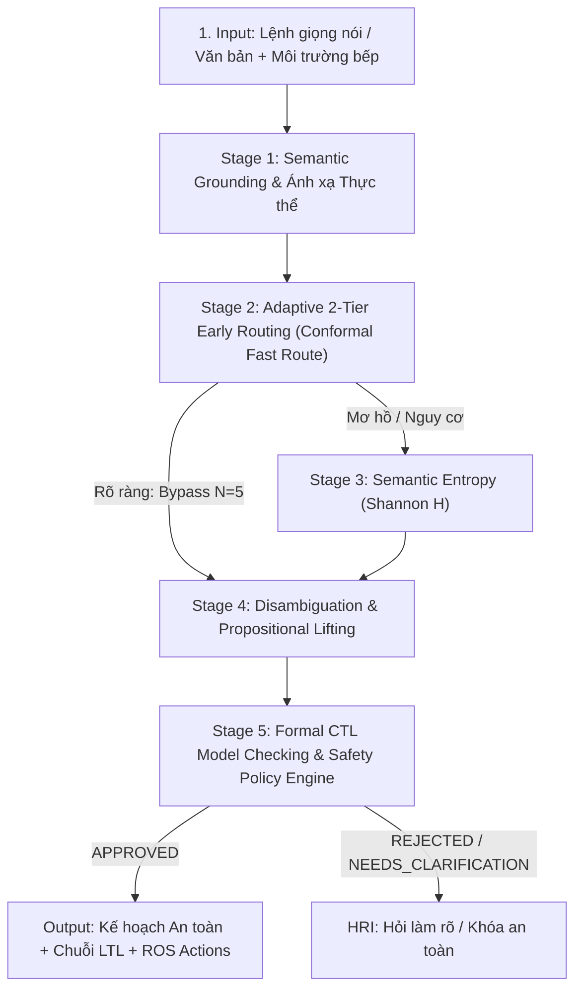

# 🤖 Embodied AI Kitchen Robot: Neuro-Symbolic AmbiK Pipeline

> **Hệ thống Xử lý Mơ hồ Ngôn ngữ Tự nhiên & Kiểm chứng An toàn Hình thức cho Robot Nhà Bếp**
> 
> *Tích hợp Semantic Entropy, Conformal Prediction (KnowNo), Formal Safety Verification (CTL Model Checking) và ROS Bridge.*

---

## 📌 1. Tổng quan Dự án (Project Overview)

Dự án phát triển hệ thống điều khiển nhận thức (Cognitive Controller) cho Robot Nhà Bếp dựa trên kiến trúc **Neuro-Symbolic AI**, giải quyết bài toán cốt lõi:
* **Xử lý sự mơ hồ trong câu lệnh tự nhiên:** Khi con người ra lệnh không đầy đủ (*"Pha cà phê"*, *"Hâm nóng súp"*), hệ thống tự động lượng hóa mức độ mơ hồ bằng **Semantic Entropy** ($H(X)$) và **Conformal Prediction** ($1-\alpha=95\%$).
* **Tương tác làm rõ Người - Robot (HRI Clarification):** Chủ động dừng lại và hỏi lại người dùng bằng câu hỏi trắc nghiệm $k$-Choice khi phát hiện mơ hồ về **Sở thích (Preferences)** hoặc **An toàn (Safety)**.
* **Tấm khiên An toàn Toán học Hình thức:** Kiểm chứng bất biến an toàn vật lý bằng **Computation Tree Logic (CTL)** trên cấu trúc Kripke và **SafetyPolicyEngine** tiền điều kiện xác định trước khi cấp phép thực thi cho Robot.
* **Đầu ra Hình thức (LTL/CTL Action Plan):** Xuất chuỗi kế hoạch trừu tượng hóa mệnh đề (Lifted NL: `prop_1 -> prop_2 -> ...`) và ánh xạ sang các ROS Action Goals.

---

## 🏗️ 2. Kiến trúc Pipeline 5 Bước (5-Stage Architecture)



---

## 🚀 3. Hướng dẫn Cài đặt & Chạy (Quick Start)

### Yêu cầu hệ thống:
* Python 3.10+
* Windows / Linux (Ubuntu) / macOS

### Bước 1: Cài đặt thư viện
```bash
pip install -r requirements.txt
```

### Bước 2: Khởi động Server AI
```bash
python main.py
```
* Giao diện Web: Truy cập **`http://localhost:8000`**
* Endpoint API Backend: **`http://localhost:8000/api/analyze`**

---

## 🤖 4. Tích hợp Robot / ROS (Embedded Integration)

Toàn bộ tài liệu đặc tả API và mã nguồn kết nối Robot nằm trong thư mục `ros_integration/`:
* **[`ros_integration/API_CONTRACT.md`](./ros_integration/API_CONTRACT.md):** Tài liệu đặc tả hợp đồng dữ liệu chuẩn JSON cho đội ngũ nhúng.
* **[`ros_integration/ambik_ros_bridge.py`](./ros_integration/ambik_ros_bridge.py):** Node cầu nối mẫu bằng Python để kiểm tra điều khiển robot.

### Chạy thử nghiệm ROS Bridge:
```bash
python ros_integration/ambik_ros_bridge.py
```

---

## 📁 5. Cấu trúc Thư mục (Directory Structure)

```text
.
├── main.py                     # FastAPI Backend Server chính
├── ambik_analyzer.py           # Bộ lõi phân tích Neuro-Symbolic & Pipeline 5 bước
├── safety_policy.py            # Động cơ kiểm tra 6 luật an toàn vật lý cứng
├── conformal_calibrator.py     # Bộ tính toán thống kê Conformal Prediction
├── ambik_calib_scores.json     # Bảng điểm Calibration chuẩn
├── data_loader.py              # Module nạp và bóc tách mẫu Dataset AmbiK
├── evaluate_benchmark.py       # Bộ đánh giá định lượng Benchmark Suite (A/B/C)
├── requirements.txt            # Danh sách gói phụ thuộc Python
├── Dockerfile                  # Cấu hình container hóa Docker
├── schemas/                    # Pydantic Schemas (EnvironmentState, ExecutionStep)
│   ├── __init__.py
│   └── environment.py
├── AmbiK-dataset/              # Tập dữ liệu chuẩn AmbiK Benchmark
├── static/                     # Giao diện Web UI, CSS, JS & Slide báo cáo
│   ├── index.html
│   ├── app.js
│   ├── style.css
│   └── presentation.html
└── ros_integration/           # Bộ công cụ tích hợp Robot & ROS
    ├── API_CONTRACT.md
    ├── README.md
    └── ambik_ros_bridge.py
```

---

## 📄 6. Tham khảo Khoa học (Academic References)

* **AmbiK Benchmark:** *AmbiK: Dataset of Ambiguous Tasks in Kitchen Environment* (ACL 2025).
* **KnowNo (Conformal Prediction):** *Robots That Ask For Help: Uncertainty Alignment for Large Language Model Planners* (CoRL 2023 - Best Student Paper).
* **Semantic Entropy:** *Detecting hallucinations in large language models using semantic entropy* (Nature 2024).
* **AutoTAMP:** *AutoTAMP: Autoregressive Task and Motion Planning with LLMs as Translators and Checkers* (ICRA 2024).
